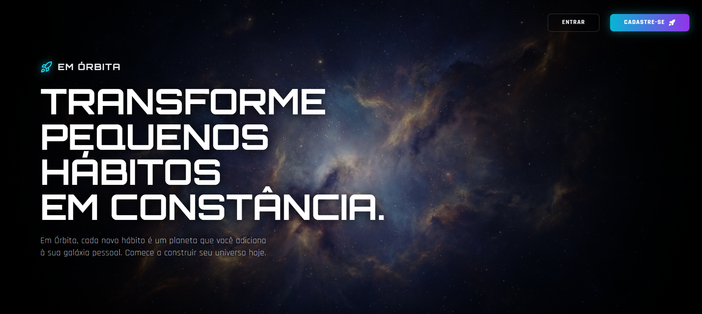

# 🪐 Em Órbita
### Gamified Habit Tracker

*Transformando hábitos em um sistema planetário vivo*

[](https://em-orbita-nine.vercel.app/)
[]()
[](https://react.dev/)
[](https://firebase.google.com/)
[](https://tailwindcss.com/)
[](https://vercel.com/)


</div>

---

## 🎯 Sobre o Projeto

O **Em Órbita** não é apenas uma lista de tarefas. É um estudo de caso sobre como **metáforas visuais e feedback sensorial** podem aumentar o engajamento do usuário.

Neste projeto, transformei dados frios (checkboxes) em um **sistema planetário vivo**. O objetivo técnico foi demonstrar domínio sobre manipulação de estado complexo, animações CSS performáticas, integração com serviços de backend (Firebase) e separação de responsabilidades (Clean Code).

> 💡 Cada hábito é um planeta em órbita. Mantenha a consistência — ou seu planeta morre.

---

## 🚧 Status do Projeto

### ✅ O que já foi feito

**Infraestrutura e Dados**
- ✅ **Firebase Auth 100%:** Login, cadastro, recuperação de senha e logout.
- ✅ **Rotas Protegidas:** Nenhum usuário acessa a aplicação sem autenticação.
- ✅ **Banco de Dados (Firestore):** Hábitos migrados do `localStorage` para o Firestore — cada usuário vê apenas a sua própria galáxia.
- ✅ **Loading States:** Feedback visual enquanto os dados carregam.

**Lógica e UX Espacial**
- ✅ **Cálculo Real de Streak:** `useCosmicHabits` busca sequências direto do histórico no Firestore. O streak não some mais ao fechar o app.
- ✅ **Identidade do Usuário:** A `EstrelaCentral` exibe o nome real do usuário autenticado em vez de um "Eu" genérico.
- ✅ **Indicador de "Hoje":** O `Planet.jsx` brilha em verde, ganha um badge ✅, exibe a tooltip "Concluído hoje!" e a trilha orbital fica verde quando o hábito do dia é marcado.
- ✅ **Base de Edição:** A função `editHabit` já foi criada no hook — pronta para ser conectada a um Modal.

---

## 🗺️ Roadmap

```
Fase 1 — Fundação          Fase 2 — Interação         Fase 3 — Retenção
──────────────────         ──────────────────         ─────────────────
✅ Firebase Auth           ⬜ Modal de Edição          ⬜ Onboarding
✅ Rotas Protegidas        ⬜ Página de Detalhes       ⬜ Responsividade
✅ Firestore               ⬜ Dashboard de Stats            Mobile
✅ Streak Real             ⬜ % concluídos hoje
✅ Indicador de Hoje       ⬜ Visão semanal/mensal
```

### Próximos Passos em Detalhe

#### 1. 🪐 Funcionalidades de Interação com Hábitos
- [ ] **Modal de Edição:** Conectar `editHabit` (já no hook) a um Modal que permita trocar nome, ícone e cor de um planeta existente.
- [ ] **Acesso à Página de Detalhes:** A página já existe, mas está oculta. Adicionar um botão visível (ex: ícone de "Info" na tooltip do planeta) para navegar até ela.

#### 2. 📊 Visualização de Dados
- [ ] **Dashboard de Progresso:** Painel (aba lateral ou modal flutuante) com:
  - [ ] % de hábitos concluídos hoje
  - [ ] Visão geral da semana
  - [ ] Visão geral do mês

#### 3. 🛸 UX e Retenção
- [ ] **Onboarding — A Primeira Viagem:** Interface de "Empty State" para usuários novos (ex: *"Sua galáxia está vazia. Crie seu primeiro planeta."*).
- [ ] **Responsividade Mobile:** Garantir que Estrela Central, órbitas e modais não quebrem em telas pequenas.

---

## 💻 Destaques Técnicos

### 1. Arquitetura Desacoplada (Custom Hooks)
Toda a regra de negócio (CRUD no Firestore, cálculo de datas, lógica de streaks) foi extraída da camada visual e isolada no hook `useCosmicHabits`.

> **Benefício:** A UI (`Universe.jsx`) fica limpa, apenas reagindo aos dados — facilitando manutenção e testes futuros.

### 2. Otimização e UX ("Juice")
Micro-interações refinadas para aumentar a satisfação do usuário:
- **Feedback Auditivo:** Web Audio API para sons de sucesso e interação.
- **Feedback Visual:** Animações de órbita via CSS puro (alta performance) e tooltips contextuais que mudam cor e conteúdo conforme o modo (Edição vs. Visualização).
- **Prevenção de Erros:** O "Modo de Destruição" altera a interface visualmente para evitar exclusões acidentais.

### 3. Gerenciamento de Estado e Efeitos
Uso consciente de `useEffect` para sincronização com o Firestore e eventos de áudio, evitando re-renderizações desnecessárias e memory leaks.

---

## ✨ Funcionalidades Principais

| Feature | Descrição |
|---|---|
| 🪐 **Visualização Orbital** | Renderização dinâmica baseada em array de objetos. Cada planeta tem props calculadas matematicamente (velocidade, raio, cor). |
| 💀 **Sistema de Vida/Morte** | Lógica de tempo (`Date.now()`) que compara a última interação. Se > 48h, aplica `grayscale`, reduz `opacity` e desacelera a órbita. |
| 🔥 **Streak Real** | Sequências calculadas a partir do histórico persistido no Firestore — sobrevivem ao fechamento do app. |
| 🔐 **Auth + Dados por Usuário** | Firebase Auth + Firestore garantem que cada usuário acessa apenas seus próprios hábitos. |
| 🛡️ **Modo de Edição Seguro** | Toggle booleano que transforma a UI inteira, alterando tooltips para alertas de perigo e a função de clique dos planetas. |

---

## 🛠️ Stack Tecnológica

| Tecnologia | Uso |
|---|---|
| **React.js (Vite)** | Velocidade de desenvolvimento e ecossistema moderno |
| **Firebase Auth** | Autenticação completa (login, cadastro, recuperação de senha) |
| **Firestore** | Banco de dados em tempo real, dados isolados por usuário |
| **Tailwind CSS** | Estilização rápida, responsiva e consistente (Utility-First) |
| **Lucide React** | Ícones leves e vetoriais |
| **JavaScript ES6+** | `reduce`, `map`, `filter`, manipulação de `Date` |
| **Git & Conventional Commits** | Histórico de commits organizado e semântico |
| **Vercel** | Deploy contínuo a partir do repositório |

---

## 📂 Estrutura de Pastas

```
src/
├── assets/                     # Mídia estática (sons .mp3 e imagens)
├── components/                 # UI Components (Atomic Design)
│   ├── modals/                 # Modais de interação (Criar / Editar hábito)
│   ├── authComponent.jsx       # Componente base de autenticação
│   ├── componentsUniverse.jsx  # Componentes auxiliares do dashboard
│   ├── estrelaCentral.jsx      # Estrela central com nome do usuário autenticado
│   ├── fundoCosmico.jsx        # Background animado do universo
│   ├── planet.jsx              # Planeta orbital com lógica de streak e indicador de hoje
│   └── ProtectedRoute.jsx      # Guarda de rotas — redireciona usuários não autenticados
├── context/                    # Contextos globais de autenticação
│   ├── AuthContext.jsx         # Criação do contexto e export do hook useAuthContext
│   └── AuthProvider.jsx        # Provider que envolve a aplicação e expõe o usuário atual
├── hooks/                      # Lógica de negócio (Separation of Concerns)
│   ├── useAuth.js              # Hook de autenticação (login, cadastro, logout, recuperação)
│   └── useCosmicHabits.jsx     # Estado, CRUD no Firestore e lógica de streak
├── pages/                      # Views principais (Roteamento)
│   ├── cadastro.jsx            # Página de cadastro de novo usuário
│   ├── habitDetails.jsx        # Página de detalhes e histórico de um hábito
│   ├── inicial.jsx             # Landing page / tela de boas-vindas
│   ├── login.jsx               # Página de login
│   ├── recuperarSenha.jsx      # Página de recuperação de senha
│   └── universe.jsx            # Dashboard principal — o sistema solar de hábitos
├── utils/                      # Funções puras auxiliares (helpers de data)
├── App.css                     # Estilos globais da aplicação
├── App.jsx                     # Componente raiz — define rotas e providers
├── firebase.js                 # Configuração e inicialização do Firebase (Auth + Firestore)
├── index.css                   # Reset e variáveis CSS base
└── main.jsx                    # Entry point — monta o React no DOM
vercel.json                     # Configuração de deploy e rewrite de rotas (SPA)
```

---

<div align="center">

*Projeto em desenvolvimento ativo — feedbacks são bem-vindos.*

[](https://em-orbita-nine.vercel.app/)

</div>
